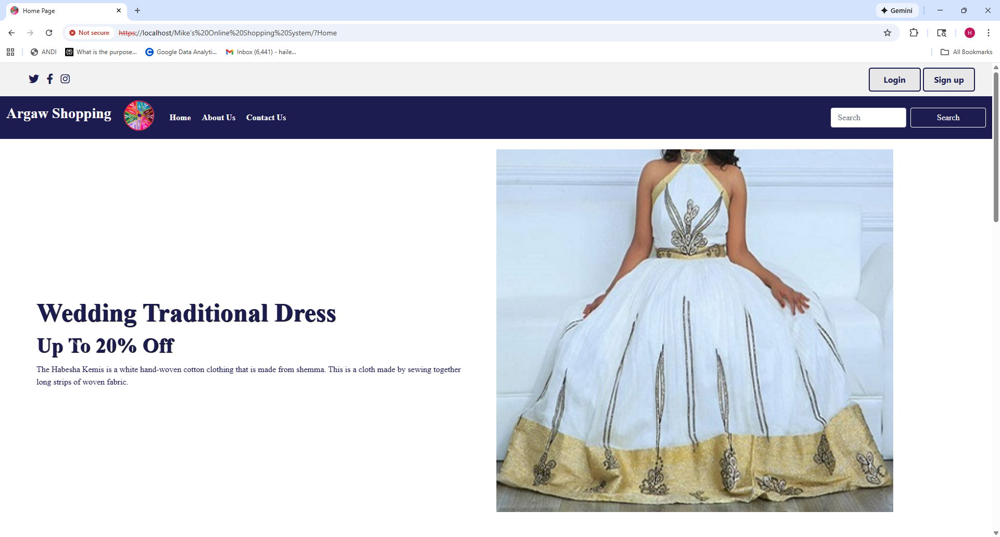
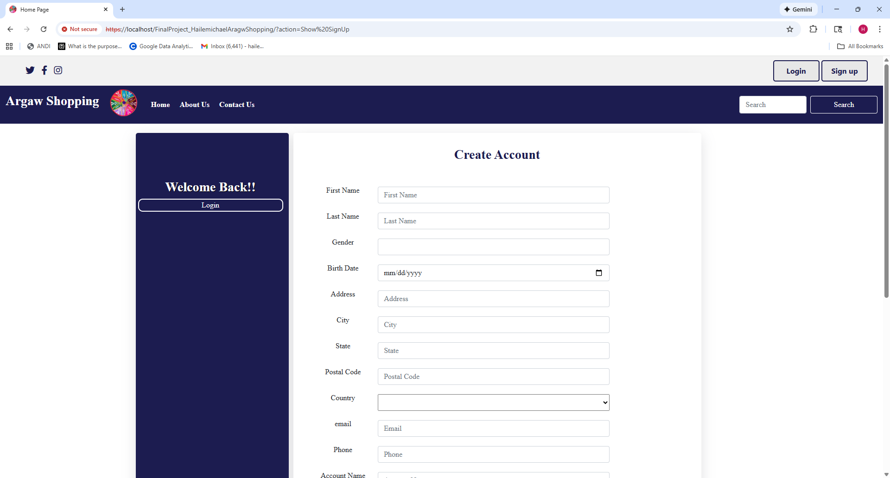
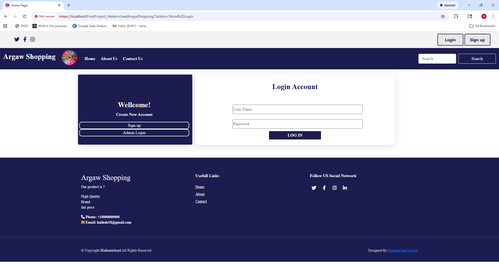

# Mike's Online Shopping System

## Table of Contents
- [About The Project](#about-the-project)
- [Built With](#built-with)
- [Features - Demo](#features---demo)
- [Demo Video](#demo-video)
- [Contact](#contact)

---

## About The Project

Mike's Online Shopping System is a fully functional, database-driven web application designed to facilitate online sales and order management. The core goal of the system is to allow customers to browse products, create an account, place orders, and review their ordered items.

The system supports multiple actors, including:

- **Customer:** Registers, searches for products, places orders, makes payments, and tracks order status.  
- **Product Administrator (Admin):** Manages the product list by adding new products, updating product details, and removing products.  
- **Warehouse Personnel:** Views order lists, monitors product quantities, and manages inventory.  
- **Sellers:** Promotes products and views stock availability.  
- **Delivery Partner:** Accesses customer addresses and delivery lists.

The site ensures a secure user experience by enforcing secure connections and using proper password encryption. It applies the Model-View-Controller (MVC) pattern and other web development best practices.

**System Documentation:** This repository also includes the *Mike's Online Shopping System Use Case Specification Document*, which outlines the functional behavior of the system from the perspective of its primary actors.

---

## Built With

The following technologies were used to build the application:

- **Server-Side Logic:** PHP  
- **Database:** MariaDB (Relational database server)  
- **Templating Engine:** Twig  
- **Front-End Framework:** Bootstrap (used exclusively in the view)  
- **Architecture:** MVC Pattern  
- **Session Management:** Session cookies  

---

## Features - Demo

1. **Home Page**  
   Displays the main entry point for the online shopping system.  

   

2. **About Page - About Our Service**  
   Provides information about the company's contact details and services/products offered.  

   

3. **Signup Page - Create Account**  
   Form for new customers to register for an account.  

   

4. **Login Page - Login Account**  
   Form for authenticated users (Customers, Admin, or Warehouse Personnel) to access the system. Customers must login to order products and review their orders.  

   

---

## Demo Video

Watch the full demonstration of the application:

[Mike’s Online Shopping Demo](./Mike’s Online Shopping_Demo.mp4)

---

## Contact

**Author:** Michael Arg.
**Email:** michgw7@gmail.com
